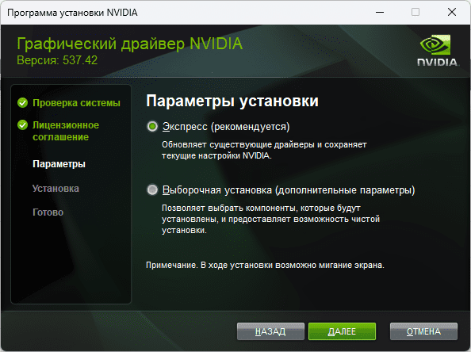

# Отчет о выполнении лабораторной работы №14

**Студент:** [Рябов Никита Алексеевич]  
**Группа:** [28Ипо8481]  
**Тема:** Настройка и обновление драйверов  

## Цель работы
Научиться использовать всевозможные средства поиска и настройки драйверов оборудования компьютера.

---

## 1. Ход работы

Для выяснения ИД установленного оборудования я зашел в свойства системы, выбрал вкладку оборудование и нажал «Диспетчер устройств». Далее для каждого устройства я открывал его свойства, переходил во вкладку «Сведения» и выбирал в ниспадающем списке «ИД Оборудования». 

Полученные значения ИД оборудования, а также текущие версии драйверов из вкладки «Драйвер» были выписаны. Используя полученные идентификаторы (параметры VEN — код производителя и DEV — код устройства), я осуществил поиск новых версий драйверов в интернете.

Результаты занесены в таблицу ниже:

| № | Оборудование | ID оборудования | Версия драйвера | Новая версия драйвера (Подкрепить скриншотом) |
|---|---|---|---|---|
| **1** | Видеоадаптер | `PCI\VEN_10DE&DEV_1C03&SUBSYS_11D710DE` | 27.21.14.5671 | 537.42  () |
| **2** | Звуковое устройство | `HDAUDIO\FUNC_01&VEN_10EC&DEV_0892` | 6.0.1.8186 | 6.0.9709.1   ) |
| **3** | Процессор | `ACPI\GenuineIntel_-_Intel64_Family_6` | 10.0.19041.546 | XXX   ) |
| **4** | Дисковое устройство | `SCSI\DiskKINGSTON_SA400S37240G` | 10.0.19041.789 | 10.0.19041.1865    |
| **5** | Сетевой адаптер | `PCI\VEN_10EC&DEV_8168&SUBSYS_E0001458` | 10.50.511.2021 | 10.68.815.2023    |

---

## 2. Контрольные вопросы

### 1. Что такое драйвер?
**Драйвер** — это компьютерное программное обеспечение, с помощью которого другое программное обеспечение (операционная система) получает доступ к аппаратному обеспечению некоторого устройства. 

* Без драйверов для ключевых компонентов аппаратного обеспечения система не сможет работать. 
* Иногда драйвер может не взаимодействовать с устройствами напрямую, а только имитировать их или предоставлять программные сервисы, не связанные с управлением устройствами.

### 2. Что такое ИД оборудования и его расшифровка параметров?
**ИД оборудования** — это уникальный идентификатор, с помощью которого система определяет, какое именно устройство установлено и какой производитель его выпустил. 

В строке ИД оборудования ключевыми являются следующие параметры:
* **VEN (Vendor)** — код производителя устройства. Данный код присваивается каждому производителю для его однозначного определения.
* **DEV (Device)** — код самого устройства.

---

## Вывод
В ходе выполнения лабораторной работы я научился использовать диспетчер устройств операционной системы для получения сведений об оборудовании компьютера. Я освоил поиск идентификаторов устройств (ИД оборудования, параметры VEN и DEV), а также научился находить актуальные версии драйверов в интернете для последующего обновления аппаратного обеспечения. Цель работы достигнута.