# Лабораторные работы: ОС GNU/Linux

**Студент:** Рябов Никита
**Платформа:** Debian (VirtualBox), учётная запись `vboxuser`

В этом файле — две лабы подряд: команды оболочки (№34) и Midnight Commander (№35/36). Делал всё в одной сессии, поэтому объединил в один README.

---

## Часть 1. Команды оболочки

### Вход в режим суперпользователя

Прежде чем работать с `/tmp` и создавать файлы вне домашнего каталога, понадобился root.

```bash
su -
sudo -
sudo su -
```

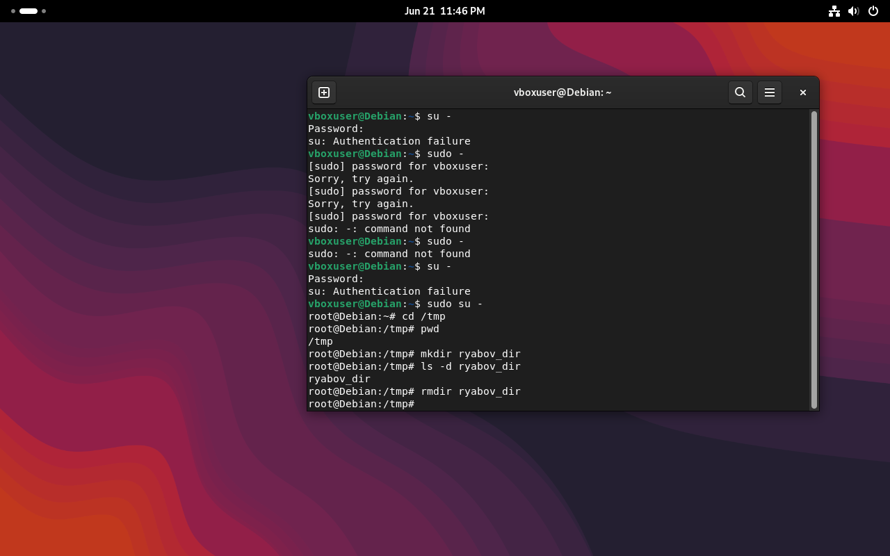

С первого раза не зашло: `su -` выдал `Authentication failure`, `sudo -` — `command not found` (неправильный синтаксис, после `sudo` нужна команда, а не голый дефис). Сработал только `sudo su -`. После этого приглашение сменилось на `root@Debian:~#`, и дальше всё пошло от root.

### Каталоги: создать, проверить, удалить

```bash
cd /tmp
pwd
mkdir ryabov_dir
ls -d ryabov_dir
rmdir ryabov_dir
```

Здесь всё просто:
- `pwd` — проверка, что я действительно в `/tmp`;
- `mkdir ryabov_dir` — создал каталог;
- `ls -d ryabov_dir` — `-d` важен, без него `ls` показал бы содержимое каталога (а он пустой), а с `-d` показывает сам каталог как объект;
- `rmdir ryabov_dir` — удаление прошло без ошибок, значит каталог действительно был пустым (`rmdir` не удаляет каталоги с файлами внутри).

### Файлы: создание, копия, переименование

```bash
touch r_file1
cp r_file1 r_file_copy
mv r_file_copy r_file_new
ls -l r_file*
```

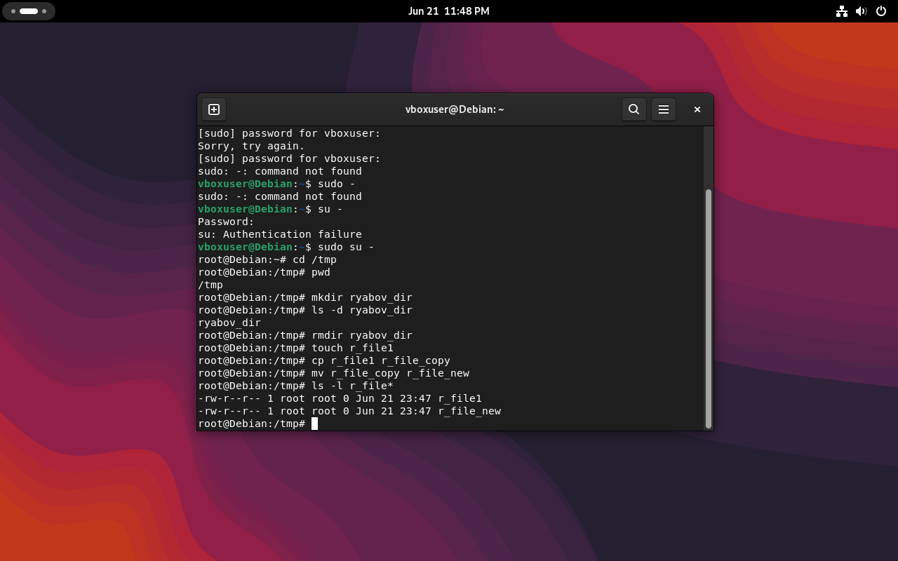

Результат:
```
-rw-r--r-- 1 root root 0 Jun 21 23:47 r_file1
-rw-r--r-- 1 root root 0 Jun 21 23:47 r_file_new
```

Логика: `touch` создаёт пустышку, `cp` дублирует её под новым именем, а `mv` — это не «перемещение» в буквальном смысле, а смена имени/расположения. В итоге файл, который был `r_file_copy`, теперь называется `r_file_new` — это видно по тому, что `r_file_copy` из списка пропал, а `r_file_new` появился с той же датой создания, что и оригинал.

### Символическая ссылка

```bash
touch original_ryabov
ln -s original_ryabov link_ryabov
ls -l *ryabov
```

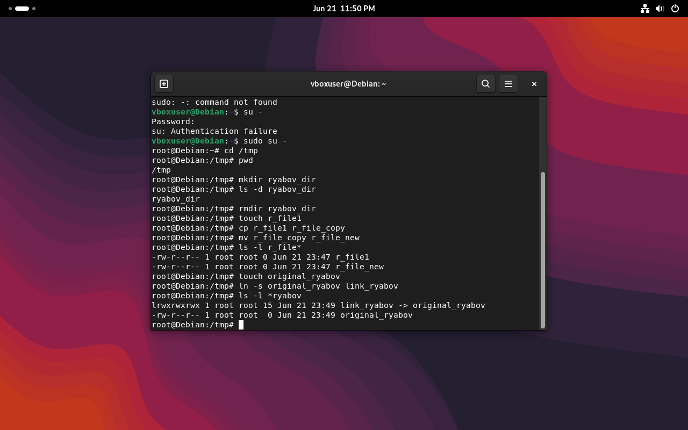

```
lrwxrwxrwx 1 root root 15 Jun 21 23:49 link_ryabov -> original_ryabov
-rw-r--r-- 1 root root  0 Jun 21 23:49 original_ryabov
```

Признаки символической ссылки в выводе `ls -l`:
1. первая буква строки прав — `l` (link), а не `-` (обычный файл);
2. права всегда показаны как `rwxrwxrwx` независимо от реальных прав на файл-цель — это особенность отображения, реальные ограничения проверяются на стороне `original_ryabov`;
3. стрелка `->` в конце строки указывает на файл, к которому привязана ссылка.

### Сколько места занято

```bash
df -h
du -sh /var
```

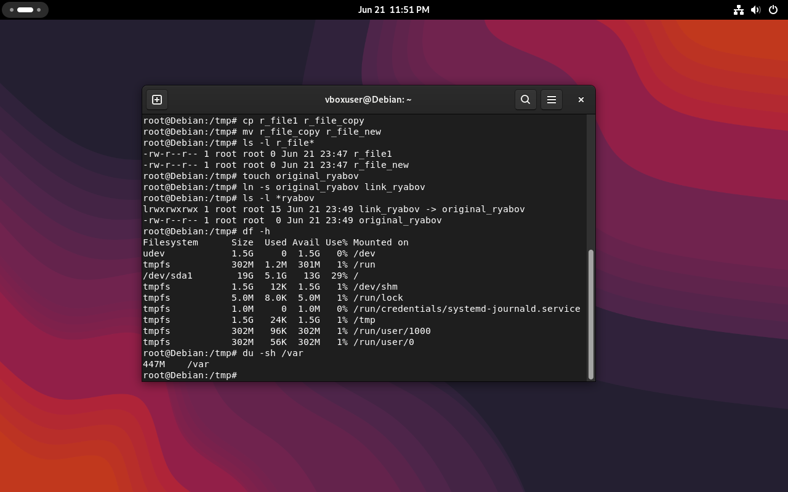

`df -h` — общая картина по разделам:
```
/dev/sda1   19G  5.1G   13G  29% /
```

`du -sh /var` — точечный замер одного каталога:
```
447M    /var
```

Разница между этими двумя командами: `df` смотрит на файловую систему целиком (что занято на диске физически), а `du` считает, сколько весит конкретный каталог со всем содержимым внутри. Иногда цифры не совпадают идеально из-за того, что `df` учитывает зарезервированное место и блоки, которые `du` не считает.

### Права доступа на объединённый файл

```bash
mkdir /r_data
echo "RYABOV LINUX" > /r_data/r_f1
touch /r_data/r_cat
cat /r_data/r_f1 /r_data/r_cat > /r_data/R_Copy
chown root:28ipo8481 /r_data/R_Copy
chmod 771 /r_data/R_Copy
ls -l /r_data
```

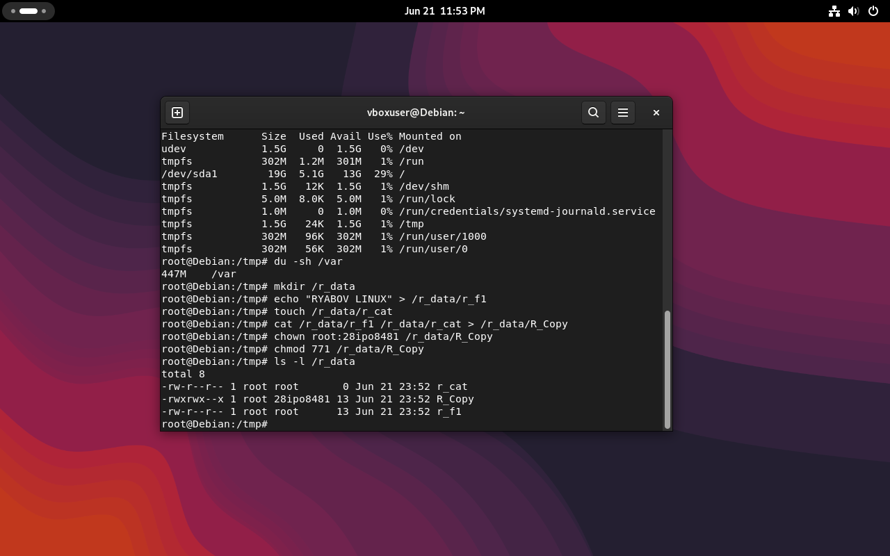

```
-rw-r--r-- 1 root root         0 Jun 21 23:52 r_cat
-rwxrwx--x 1 root 28ipo8481   13 Jun 21 23:52 R_Copy
-rw-r--r-- 1 root root        13 Jun 21 23:52 r_f1
```

Что произошло по шагам: сначала текстовый `r_f1` с фразой «RYABOV LINUX» и пустой `r_cat`, потом `cat` склеил их в `R_Copy`. Дальше — права: `chown root:28ipo8481` сменил группу-владельца (группа названа по номеру учебной группы), а `chmod 771` дал владельцу и группе полный доступ (rwx), а всем остальным — только запуск (--x), без права читать или менять файл.

---

## Часть 2. Midnight Commander

### Две панели на одном каталоге

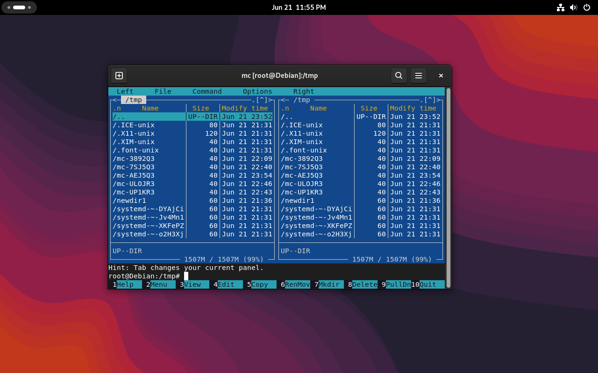

Запустил `mc` от root — обе панели открыты на `/tmp` в обычном режиме File listing. Это стартовая точка: отсюда удобно и копировать между панелями, и переключать правую в другие режимы просмотра.

### Дерево каталогов

`<F9> → Right → Tree`.

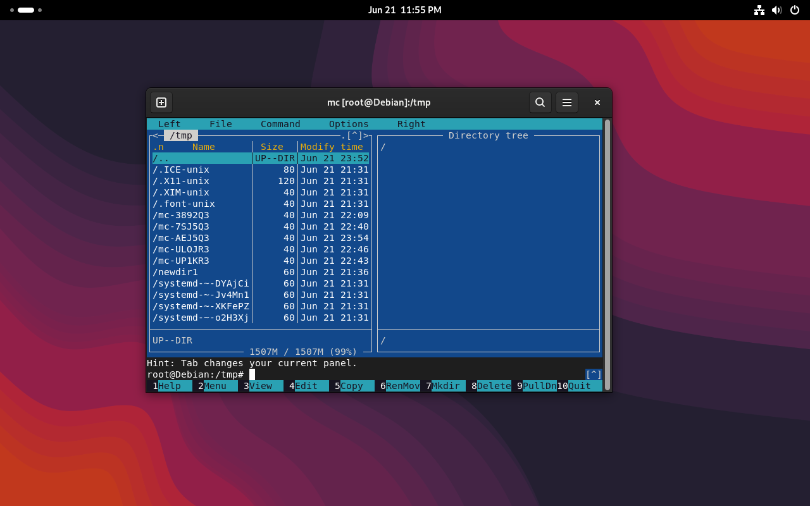

Правую панель переключил в режим дерева — там структура от корня `/`. Удобно для навигации по иерархии без захода в каждую папку вручную.

### Info — атрибуты объекта

`<F9> → Right → Info`.

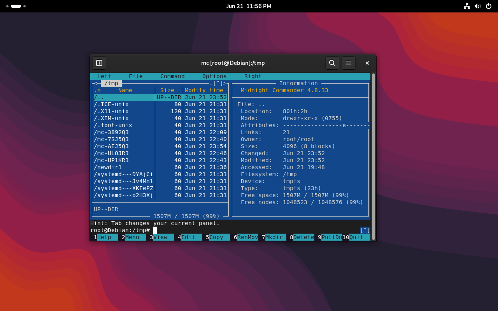

Панель Info раскладывает выбранный объект по полочкам: режим `drwxr-xr-x (0755)`, владелец `root:root`, файловая система `tmpfs` (временная ФС в памяти, а не обычный диск), и сколько места свободно (почти 100%, потому что под `/tmp` на tmpfs отведено немного).

### Quick View — предпросмотр без редактора

`<F9> → Right → Quick View`.

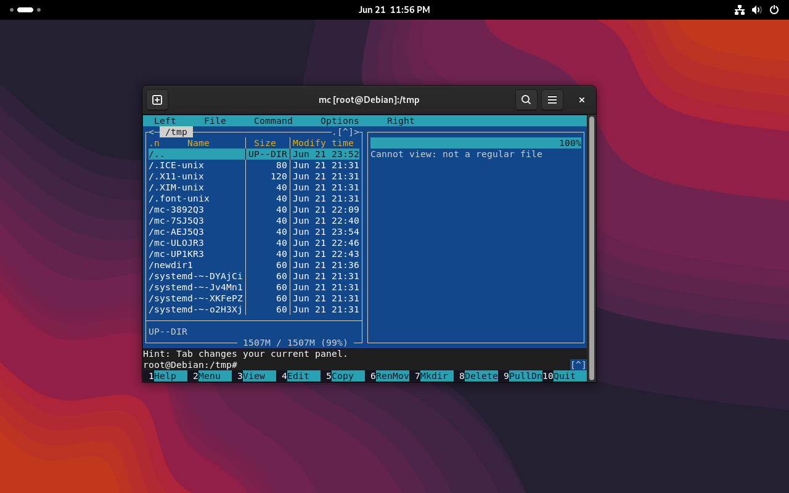

Выделил `..` (родительский каталог) — программа ответила `Cannot view: not a regular file`. Логично: Quick View показывает содержимое обычных файлов, а каталог файлом с содержимым в этом смысле не является.

### Копирование между панелями (`F5`)

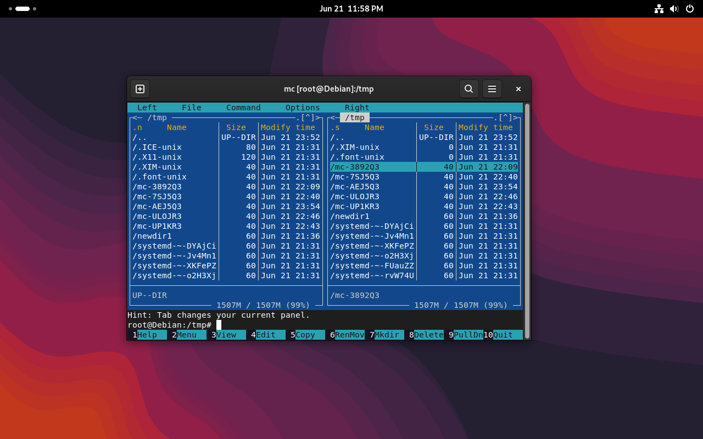

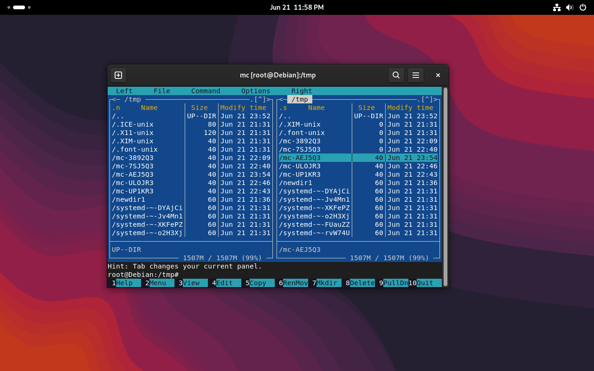

Правая панель снова в режиме File listing, копирую объекты с левой на правую клавишей `F5`. На первом скрине курсор на `mc-3892Q3`, на втором — на `mc-AEJ5Q3`. После копирования объект остаётся слева и появляется справа (в отличие от перемещения `F6`, которое убрало бы исходник). Правая панель здесь отсортирована по размеру (`.s` в заголовке столбца), поэтому нулевые объекты поднялись наверх.

### Создание каталога через `F7`

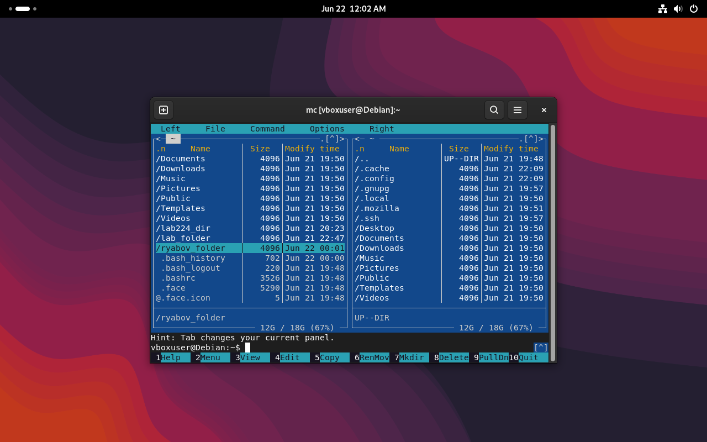

`ryabov_folder` создан в домашнем каталоге (клавиша `F7` → диалог Mkdir) и встал в списке рядом с `lab224_dir` и `lab_folder`. По сути `F7` — это тот же `mkdir`, только через окно, а не команду в строке.

---

## Итог

Прошёл по всем основным операциям с файлами и каталогами в Linux: создание/удаление через `mkdir`/`rmdir`/`touch`/`rm`, копирование и переименование (`cp`, `mv`), символические ссылки (`ln -s`), проверку занятого места (`df`, `du`) и настройку прав через `chown`/`chmod`. Отдельно — те же по смыслу операции, но в Midnight Commander: просмотр атрибутов, предпросмотр файлов, копирование между панелями, дерево каталогов и создание новых папок через горячие клавиши.