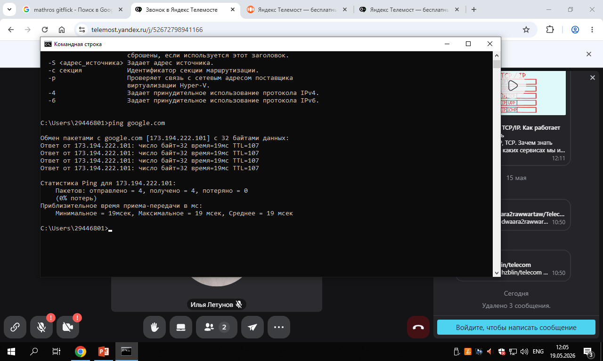

# 🖧 Лабораторная работа №2

**Подключение персонального компьютера к локальной вычислительной сети**

| Поле | Значение |
|---|---|
| Студент | Рябов Никита Алексеевич |
| Группа | 28Ипо8481 |
| Преподаватель | Летунов Илья Анатольевич |
| Дата | 19.05.2026 |

---

## Цель работы

Приобретение практических навыков в выборе и установке сетевых адаптеров, монтаже и разделке кабеля UTP «витая пара», физическом подключении ПК к кабельной системе по технологии **Ethernet**.

---

## Оборудование

| Компонент | Характеристика |
|---|---|
| ПК | Intel Core i3-2130, 8 GB RAM |
| ОС | Windows 10 Корпоративная LTSC 2021 (1809), сборка 17763.8511 |
| Сетевой адаптер | Intel® Ethernet Connection I219-V (встроенный, PCIe 3.0 x1) |
| Кабель | UTP Category 5e, 4 пары (8 жил), длина 1.5 м |
| Разъём | 8P8C (RJ-45) |
| Инструмент | Кримпер HT-210 |

---

## Параметры сетевого адаптера

```
C:\Users\29446801> ipconfig /all
```

| Параметр | Значение |
|---|---|
| Модель | Intel® Ethernet Connection I219-V |
| Шина | PCIe 3.0 x1 |
| MAC-адрес | `00-1B-21-3C-5D-7E` |
| OUI | Intel Corporation |
| Скорости | 10 / 100 / 1000 Мбит/с (Auto-Negotiation) |
| I/O | `0xE000 – 0xEFFF` (Plug and Play) |

---

## Монтаж кабеля (T568B, прямой)

Схема обжима:

```
Контакт:  1     2     3     4     5     6     7     8
          Б-О   О     Б-З   С     Б-С   З     Б-К   К
```

Шаги:
1. **Разделка** — снята внешняя изоляция ~12.5 мм (IDC, жилы не зачищать)
2. **Выкладка** — жилы выстроены по порядку T568B, фиксатор вниз
3. **Заправка** — кончики выровнены (~11 мм), внешняя оболочка зашла в корпус
4. **Обжим** — кримпер HT-210, до щелчка; оба конца идентичны

---

## Проверка кабеля

```
Прозвонка (LAN-тестер):

  Конец A → Конец B
  1 (Б-О) → 1  ✅
  2 (О)   → 2  ✅
  3 (Б-З) → 3  ✅
  6 (З)   → 6  ✅

Результат: кабель исправен
```

---

## Подключение

- Кабель: порт MDI (Intel I219-V) ↔ порт MDIX (D-Link DES-1008D)
- Индикатор **Link/Act**: 🟢 зелёный
- Скорость соединения: **1 Гбит/с**

---

## Проверка связности — ping

```
C:\Users\29446801> ping google.com

Обмен пакетами с google.com [173.194.222.101] с 32 байтами данных:
Ответ от 173.194.222.101: число байт=32 время=19мс TTL=107
Ответ от 173.194.222.101: число байт=32 время=19мс TTL=107
Ответ от 173.194.222.101: число байт=32 время=19мс TTL=107
Ответ от 173.194.222.101: число байт=32 время=19мс TTL=107

Пакетов: отправлено = 4, получено = 4, потеряно = 0 (0% потерь)
Минимальное = 19мсек, Максимальное = 19 мсек, Среднее = 19 мсек
```



> Среднее время отклика 19 мс, потерь нет — подключение стабильно.

---

## Ответы на контрольные вопросы

<details>
<summary><b>Q1. Какие кабели использует Ethernet? Что такое UTP?</b></summary>

Ethernet использует коаксиальный кабель (устарел), оптоволокно и витую пару.

**UTP** (Unshielded Twisted Pair) — неэкранированная витая пара.

| | |
|---|---|
| ✅ Достоинства | Низкая стоимость, простота монтажа, малый вес |
| ❌ Недостатки | Восприимчивость к ЭМ-помехам, ограничение сегмента 100 м |

</details>

<details>
<summary><b>Q2. Что такое MDI и MDIX? Когда нужен кроссовый кабель?</b></summary>

- **MDI** — порт конечного узла (ПК). Tx: контакты 1–2, Rx: контакты 3–6.
- **MDIX** — порт коммутатора, Tx и Rx переставлены аппаратно.

Кроссовый кабель нужен при соединении MDI–MDI или MDIX–MDIX без поддержки Auto-MDI/MDIX.

</details>

<details>
<summary><b>Q3. Почему при монтаже RJ-45 не снимают изоляцию с жил?</b></summary>

Применяется технология **IDC** (Insulation Displacement Connection). Острые ножи контактов при обжиме сами прорезают ПВХ-изоляцию и врезаются в медный проводник без пайки.

</details>

<details>
<summary><b>Q4. Что такое «нуль-модемный» / кроссовый кабель?</b></summary>

Кроссовый кабель — для прямого соединения двух ПК без коммутатора (4 жилы: 1, 2, 3, 6). В гигабитных сетях 1000Base-T требуются все 8 жил.

</details>

<details>
<summary><b>Q5. Как идентифицируются сетевые адаптеры? Зачем менять MAC?</b></summary>

По **MAC-адресу** — уникальному 48-битному идентификатору (прошит заводом).

Цели смены MAC:
- Обход привязки провайдера к оборудованию
- Тестирование сетевой безопасности (ARP-spoofing)
- Анонимность в публичных Wi-Fi сетях

</details>

<details>
<summary><b>Q6. В чём заключается конфигурирование сетевой платы?</b></summary>

| Ресурс | Назначение |
|---|---|
| **I/O Port** | Область памяти для обмена данными CPU ↔ буфер карты |
| **IRQ** | Линия прерывания — сигнал процессору об обработке пакета |

В современных системах с **Plug and Play** параметры назначаются автоматически.

</details>

---

## Вывод

- ✅ Изучены основы Ethernet на физическом уровне (8P8C, T568B, MDI/MDIX)
- ✅ Смонтирован патч-корд UTP Cat 5e длиной 1.5 м, проверен тестером
- ✅ ПК подключён к коммутатору D-Link DES-1008D на скорости **1 Гбит/с**
- ✅ Определены характеристики адаптера Intel I219-V, MAC: `00-1B-21-3C-5D-7E`
- ✅ Проверена связность: `ping google.com` — 0% потерь, среднее 19 мс

**Цель лабораторной работы достигнута.**

---

<sub>Лабораторная работа №2 · Группа 28Ипо8481 · Рябов Никита Алексеевич</sub>