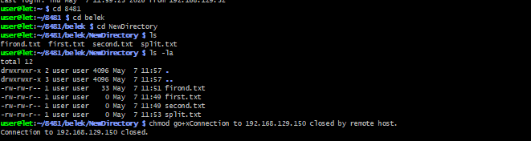

# 🔐 Лабораторная работа: Подключение к Raspberry Pi по SSH

| Поле | Значение |
|---|---|
| Студент | Рябов Никита Алексеевич |
| Группа | 28Ипо8481 |
| Преподаватель | Летунов Илья Анатольевич |

---

## Цель работы

Освоить протокол SSH для удалённого управления одноплатным компьютером Raspberry Pi: выполнить подключение по паролю, создать структуру каталогов и файлов, настроить аутентификацию по SSH-ключу.

---

## Часть 1. Подключение по паролю

### Подключение к Raspberry Pi

```bash
ssh user@192.168.129.150
```

После выполнения команды ввести пароль: `123`

При успешном подключении отобразится приглашение консоли Raspberry Pi.

---

### Задание: создание структуры каталогов

**1. Перейти в каталог группы в корневом разделе:**

```bash
cd /28Ипо8481
```

**2. Создать каталог с именем студента:**

```bash
mkdir Ryabov
cd Ryabov
```

**3. Создать структуру каталогов и файлов:**

```bash
mkdir -p Info/Personal
mkdir -p Info/University
mkdir -p Info/Hobby
mkdir -p A1
mkdir -p A2/B1
mkdir -p A2/B2
mkdir -p A2/B3
mkdir -p A3
```

**4. Создать текстовые файлы:**

```bash
echo "Рябов Никита Алексеевич" > Info/Personal/Name.txt
echo "Дата рождения: 01.01.2000" > Info/Personal/Date.txt
echo "Школа №1" > Info/Personal/School.txt
echo "РТУ МИРЭА, Информационные технологии" > Info/University/Name.txt
echo "Математика: 85, Русский: 90, Информатика: 92. Сумма: 267" > Info/University/Mark.txt
echo "Программирование, сетевые технологии" > Info/Hobby/hobby.txt
```

**5. Проверить структуру каталогов:**

```bash
ls -R
```

Ожидаемый вывод:

```
.:
A1  A2  A3  Info

./A1:

./A2:
B1  B2  B3

./A2/B1:
./A2/B2:
./A2/B3:

./A3:

./Info:
Hobby  Personal  University

./Info/Hobby:
hobby.txt

./Info/Personal:
Date.txt  Name.txt  School.txt

./Info/University:
Mark.txt  Name.txt
```

**Скриншот выполнения команды `ls -la`:**



---

### Отключение от SSH

```bash
exit
```

---

## Часть 2. Аутентификация по SSH-ключу

Использование ключа позволяет подключаться к Raspberry Pi **без ввода пароля**.

### Схема подключения

```
ПК (клиент)                    Raspberry Pi (сервер)
┌─────────────────┐            ┌──────────────────────┐
│  id_rsa         │            │  ~/.ssh/             │
│  (приватный ключ│  SSH       │  authorized_keys     │
│   хранится здесь│ ─────────► │  (публичный ключ)    │
└─────────────────┘            └──────────────────────┘
```

---

### Шаг 1. Проверить наличие существующих ключей

```bash
ls ~/.ssh
```

Если в выводе есть `id_rsa.pub` или `id_dsa.pub` — ключи уже существуют, шаг генерации можно пропустить.

---

### Шаг 2. Генерация SSH-ключей

```bash
ssh-keygen
```

При запросе пути нажать **Enter** (использовать путь по умолчанию `~/.ssh/`).

При запросе пароля для ключа можно нажать **Enter** (оставить пустым).

Проверить результат:

```bash
ls ~/.ssh
```

| Файл | Тип | Где хранится |
|---|---|---|
| `id_rsa` | Приватный ключ | Только на ПК |
| `id_rsa.pub` | Публичный ключ | Копируется на Raspberry Pi |

---

### Шаг 3. Копирование публичного ключа на Raspberry Pi

```bash
ssh-copy-id user@192.168.129.150
```

Команда добавит публичный ключ в файл `~/.ssh/authorized_keys` на Raspberry Pi.

---

### Шаг 4. Подключение без пароля

```bash
ssh user@192.168.129.150
```

Теперь подключение происходит автоматически, без запроса пароля.

---

## Итог

- ✅ Выполнено подключение к Raspberry Pi по SSH с паролем
- ✅ Создана структура каталогов в директории группы
- ✅ Созданы текстовые файлы с информацией о студенте
- ✅ Проверена структура командой `ls -R`
- ✅ Сгенерированы SSH-ключи (`id_rsa` / `id_rsa.pub`)
- ✅ Публичный ключ скопирован на Raspberry Pi через `ssh-copy-id`
- ✅ Настроено подключение без пароля

---

<sub>Лабораторная работа: SSH + Raspberry Pi · Группа 28Ипо8481 · Рябов Никита Алексеевич</sub>