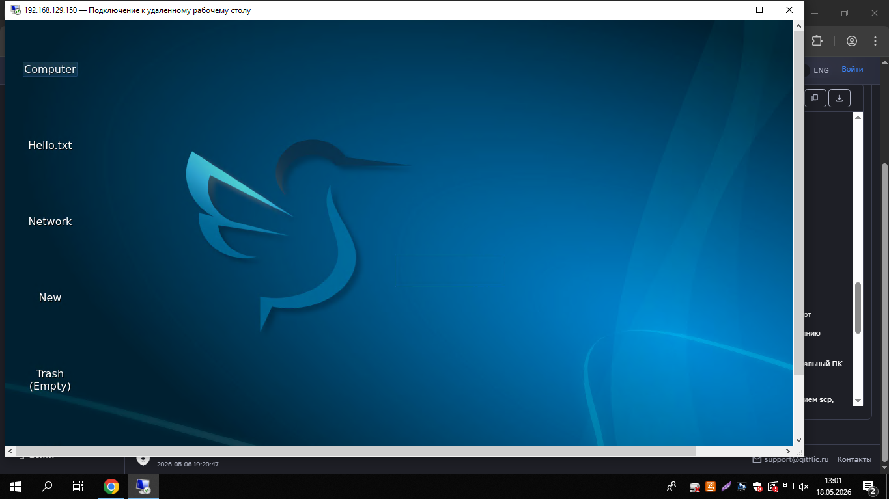
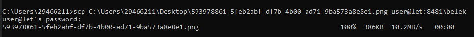

# 🖥️ Лабораторная работа: Подключение к Raspberry Pi по протоколу VNC

| Поле | Значение |
|---|---|
| Студент | Рябов Никита Алексеевич |
| Группа | 28Ипо8481 |
| Преподаватель | Летунов Илья Анатольевич |

---

## Цель работы

Освоить удалённое подключение к графическому рабочему столу Raspberry Pi через протоколы VNC и RDP, а также научиться передавать файлы между ПК и Raspberry Pi с помощью утилиты `scp`.

---

## Часть 1. Подключение по VNC (TigerVNC)

### Что потребуется

- Raspberry Pi и ПК, подключённые к одной сети
- IP-адрес Raspberry Pi: `192.168.129.150`
- Логин: `user`, пароль: `123`
- Клиент [TigerVNC](https://github.com/TigerVNC/tigervnc/releases)

### Установка TigerVNC

**Windows:** скачать `.exe` со страницы релизов, запустить двойным щелчком.

**Linux:**
```bash
sudo apt install default-jre
java -jar VncViewer-<version>.jar
```

---

### Подключение

**1.** Запустить TigerVNC, в поле «VNC-сервер» ввести IP-адрес:

```
192.168.129.150
```

**2.** Нажать «Параметры» → вкладка «Ввод» → установить флажок **«Показывать точку при отсутствии курсора»**.

**3.** Если TigerVNC выдаёт предупреждение безопасности — нажать **«Да»**.

**4.** Ввести учётные данные:

```
Имя пользователя: user
Пароль:          123
```

**5.** После успешного подключения открывается рабочий стол Raspberry Pi:



---

## Часть 2. Подключение через RDP

**1.** Открыть утилиту **«Подключение к удалённому рабочему столу»**:

`Win + R` → `mstsc` → Enter

**2.** Ввести IP-адрес и учётные данные:

```
Компьютер: 192.168.129.150
Пользователь: user
Пароль: 123
```

---

## Часть 3. Передача файлов через SCP

### Загрузка скриншота на Raspberry Pi

Скопировать файл скриншота в каталог с фамилией студента на Raspberry Pi:

```bash
scp C:\Users\29466211\Desktop\rdp_desktop.png user@192.168.129.150:~/Ryabov/
```

> Перед выполнением убедиться, что каталог `Ryabov` создан на Raspberry Pi:
> ```bash
> ssh user@192.168.129.150 "mkdir -p ~/Ryabov"
> ```



Файл передан успешно: **386 KB, 10.2 MB/s**.

---

### Скачивание файла варианта с Raspberry Pi

Скопировать файл своего варианта из каталога `letunov/` на локальный ПК:

```bash
scp user@192.168.129.150:~/letunov/1.txt ./
```

---

## Справочник команд SCP

| Операция | Команда |
|---|---|
| Загрузить файл на сервер | `scp file.txt user@192.168.129.150:/path/to/dest/` |
| Скачать файл с сервера | `scp user@192.168.129.150:/path/to/file.txt ./local-dir/` |
| Скачать папку рекурсивно | `scp -r user@192.168.129.150:/path/to/dir/ ./local-dir/` |

**Общий синтаксис:**
```bash
scp [опции] источник назначение
```

---

## Итог

- ✅ Установлен и настроен TigerVNC
- ✅ Выполнено подключение к рабочему столу Raspberry Pi по VNC
- ✅ Выполнено подключение через RDP (`mstsc`)
- ✅ Скриншот скопирован на Raspberry Pi через `scp` в каталог `Ryabov/`
- ✅ Файл варианта скачан с Raspberry Pi из каталога `letunov/`

---

<sub>Лабораторная работа: VNC + SCP · Группа 28Ипо8481 · Рябов Никита Алексеевич</sub>